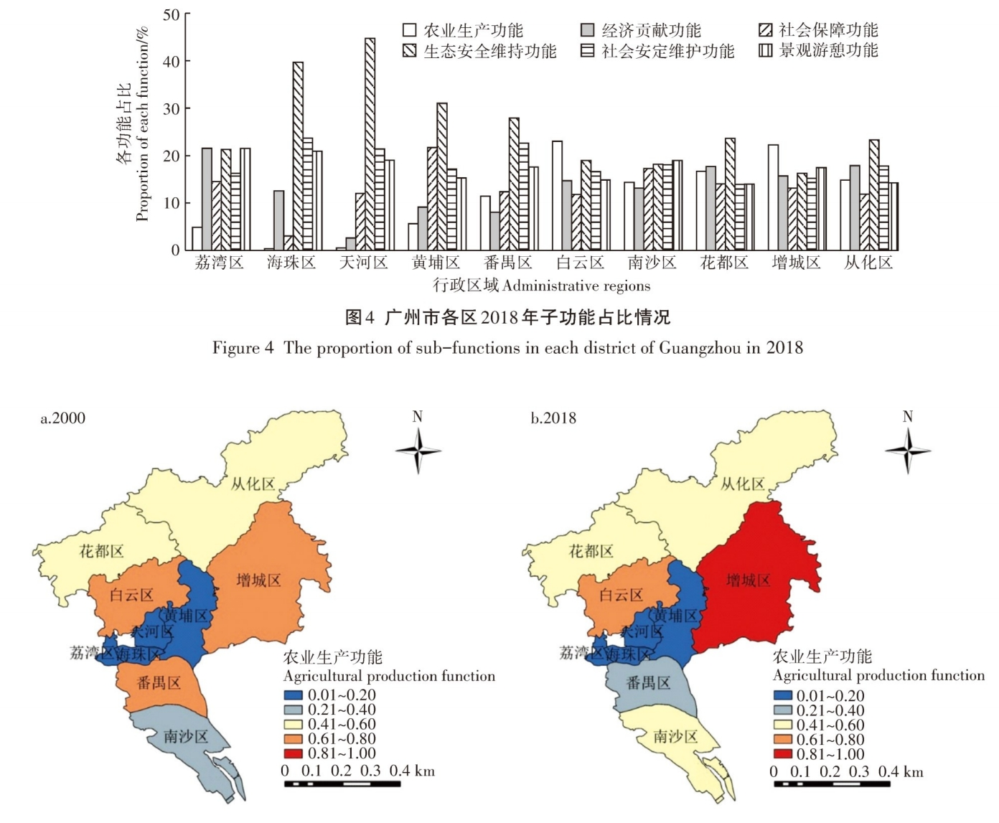
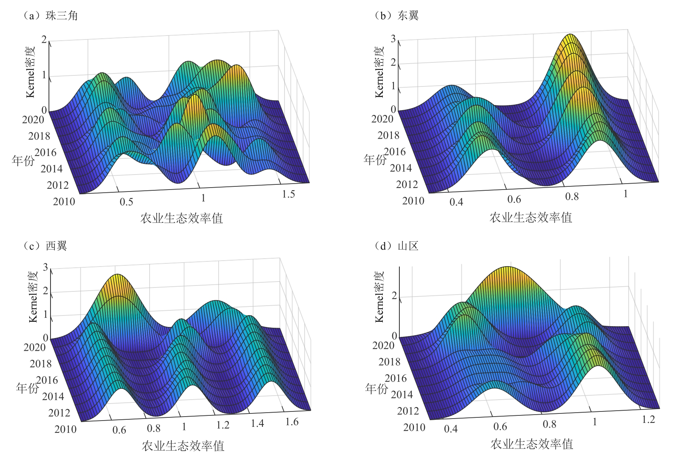








# Welcome! 
I am nobody.

Two.

Three.

Four. **Currently, I know everything.**

You can find my CV here: [Chunyun Tang's Curriculum Vitae]( ). If you are interested in my work, please feel free to drop me an [email](mailto:chunyuntang2021@gmail.com).

<!--I have published more than 100 papers at the top international AI conferences with total <a href='https://scholar.google.com/citations?user=DhtAFkwAAAAJ'>google scholar citations <strong>260000+</strong></a> (You can also use google scholar badge ).-->

<!--插入图片语法为：-->

# 📖 Educations
- *2018.09 - 2021.06*, Master of Management in Land Resource Management, South China University of Technology, Guangzhou, China
  - Supervised by [Prof. Junmei Zang]
- *2014.09 - 2018.06*, Bachelor of Management in Land Resource Management, Inner Mongolia University, Hohhot, China
  - Supervised by [Prof. Yafeng Zou]

# 🔥 News
- *2024.12*: &nbsp;New Papers.

# 📝 Publications 

IEEE Access 2023

[lunwenbiaoti](lunwenlianjie)

**Zuozhe**, 2zuo, 3zuo

<!--
[**Project**](https://scholar.google.com/citations?view_op=view_citation&hl=zh-CN&user=DhtAFkwAAAAJ&citation_for_view=DhtAFkwAAAAJ:ALROH1vI_8AC) <strong></strong>
- Lorem ipsum dolor sit amet, consectetur adipiscing elit. Vivamus ornare aliquet ipsum, ac tempus justo dapibus sit amet. 

-->

ICTETS 2023

- [lunwnetiimu](lianjie), zuoezhe, **zijizuozhe**, 3, 4 

# 🎖 Honors and Awards
- *2024.1* mingcheng

<!--
# 💬 Invited Talks
- *2021.06*, Lorem ipsum dolor sit amet, consectetur adipiscing elit. Vivamus ornare aliquet ipsum, ac tempus justo dapibus sit amet. 
- *2021.03*, Lorem ipsum dolor sit amet, consectetur adipiscing elit. Vivamus ornare aliquet ipsum, ac tempus justo dapibus sit amet.  \| [\[video\]](https://github.com/)
-->

# 💻 Working

ByteDance

  <i>座右铭</i>

