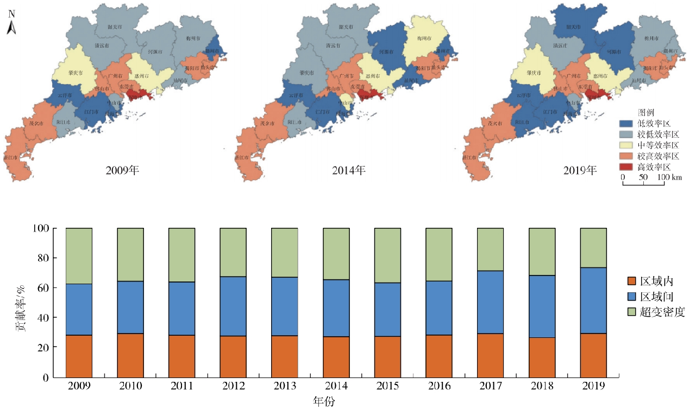








# Welcome! 
I am Chunyun Tang.

**Currently, I am applying for the PhD in Geography for 2025**

You can find my CV here: [Chunyun Tang's CV](assets/CV.pdf). If you are interested in my work, please feel free to drop me an [email](mailto:chunyuntang2021@gmail.com).

<!--I have published more than 100 papers at the top international AI conferences with total <a href='https://scholar.google.com/citations?user=DhtAFkwAAAAJ'>google scholar citations <strong>260000+</strong></a> (You can also use google scholar badge ).-->

<!--插入图片语法为：-->

# 📖 Educations
- *2018.09 - 2021.06*, Master of Management in Land Resource Management, South China University of Technology, Guangzhou, China
  - Supervised by Prof. Junmei Zang
- *2014.09 - 2018.06*, Bachelor of Management in Land Resource Management, Inner Mongolia University, Hohhot, China
  - Supervised by Prof. Yafeng Zou

# 🔥 News
- *2024.12*: &nbsp;No New Papers.

# 📝 Publications 

[Spatio-temporal Evolution and Influencing Factors of Agricultural Eco-efficiency in Guangdong Province under "Dual Carbon" Target]([http://cjarrp.ijournals.cn/zgnyzyyqh/ch/reader/view_abstract.aspx?file_no=202310013&flag=1])

Junmei Zang, Siying Zhang, **Chunyun Tang**
- **Chinese Journal of Agricultural Resources and Regional Planning**(in chinese)

<!--
[**Project**](https://scholar.google.com/citations?view_op=view_citation&hl=zh-CN&user=DhtAFkwAAAAJ&citation_for_view=DhtAFkwAAAAJ:ALROH1vI_8AC) <strong></strong>
- Lorem ipsum dolor sit amet, consectetur adipiscing elit. Vivamus ornare aliquet ipsum, ac tempus justo dapibus sit amet. 

-->

[Research on Spatial Imbalance and Influencing Factors of Cultivated Land Use Efficiency in Guangdong Province Based on Super-SBM Model]([https://www.chinalandscience.com.cn/zgtdkx/article/abstract/20210507])

Junmei Zang, **Chunyun Tang**, Qiuxiang Wang, Kuan Li, Lifan Li
- **China Land Science**(in chinese)

[Multi-functional Evaluation of Cultivated Land and An Analysis of the Temporal and Spatial Evolution of Guangzhou in the New Era]([https://www.aed.org.cn/nyzyyhjxb/ch/reader/view_abstract.aspx?file_no=20210221&flag=1])

**Chunyun Tang**, Junmei Zang
- **Chinese Journal of Agricultural Resources and Regional Planning**(in chinese)

<!--
[**Project**](https://scholar.google.com/citations?view_op=view_citation&hl=zh-CN&user=DhtAFkwAAAAJ&citation_for_view=DhtAFkwAAAAJ:ALROH1vI_8AC) <strong></strong>
- Lorem ipsum dolor sit amet, consectetur adipiscing elit. Vivamus ornare aliquet ipsum, ac tempus justo dapibus sit amet. 

-->

# 🎖 Scholarships and Awards
- *2024.01* Top Management Trainee of 2023, Guangdong Agribusiness Group Corporation
- *2018-2020* Academic Scholarship of South China University of Technology
- *2019.09* Rookie Award for Land Economy Research of the Annual Conference on Chinese Land Economics
- *2015.12* Second-class Excellent Student Scholarship of Inner Mongolia University
- *2015.04* Merit Award of the 4th Case Analysis Competition of Higher Education Institutions on Public Management in Hohhot

# 💻 Work Experience
- - *2021.07 - 2024.07*   Guangdong Agribusiness Group Corporation, Guangzhou,China
  -  Assistant Supervisor, Asset and Resources Department

  <i> </i>

